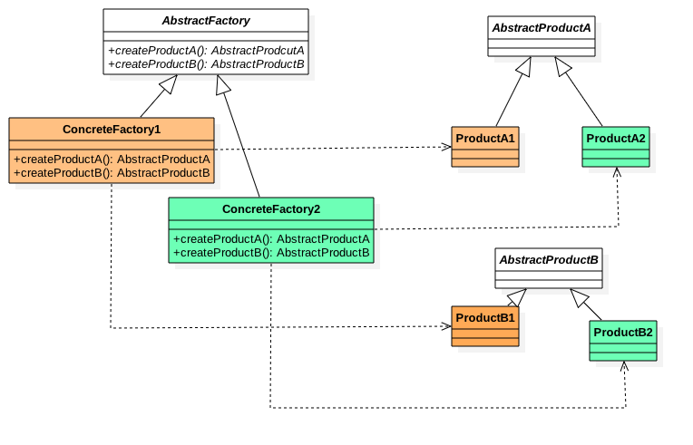

#### abstract-factory pattern
---

##### 定义

抽象工厂模式一般来是是工厂相关模式的终极形态。它与工厂方法唯一的区别就是:
**工厂的接口里是一系列创造抽象产品的方法，而不再是一个，而相应的，抽象产品也不再是一个了，而是一系列相关的产品**

抽象工厂模式的定义：
> Provide an interface for creating families of related or dependent objects without specifying their concrete classess.

翻译成中文:
>为创建一组相关或者相互依赖的对象提供一个接口，而且无须指定它们的具体类

##### 类图



##### 其他

其实`抽象工厂模式`就是`工厂方法`多了一个抽象的产品演化而来。

##### 站在巨人的肩膀上
```java
//抽象产品
interface Product{}

//具体产品
class ProductA implements Product{}
class ProductB implements Product{}

//工厂接口
interface Factory{
    Product getProduct();
}

//具体的工厂A，创造产品A
class FactoryA implements Factory{

    public Product getProduct() {
        return new ProductA();
    }
    
}
//具体的工厂B，创造产品B
class FactoryB implements Factory{

    public Product getProduct() {
        return new ProductB();
    }
    
}

/*   假设以上是一个第三方jar包中的工厂方法模式，我们无法改动源码   */

//我们自己特有的产品
interface MyProduct{}

//我们自己特有的产品实现
class MyProductA implements MyProduct{}
class MyProductB implements MyProduct{}

//我们自己的工厂接口
interface MyFactory{
    MyProduct getMyProduct();
}

//我们自己特有的工厂A，产生产品A
class MyFactoryA implements MyFactory{
    
    public MyProduct getMyProduct() {
        return new MyProductA();
    }
    
}

//我们自己特有的工厂B，产生产品B
class MyFactoryB implements MyFactory{
    
    public MyProduct getMyProduct() {
        return new MyProductB();
    }
    
}

/*  到这里是我们自己的一套工厂方法模式，去创造我们自己的产品，以下我们将以上二者组合   */

//我们使用组合的方式将我们的产品系列和jar包中的产品组合起来
class AssortedFactory implements MyFactory,Factory{
    
    MyFactory myFactory;
    Factory factory;
    
    public AssortedFactory(MyFactory myFactory, Factory factory) {
        super();
        this.myFactory = myFactory;
        this.factory = factory;
    }

    public Product getProduct() {
        return factory.getProduct();
    }

    public MyProduct getMyProduct() {
        return myFactory.getMyProduct();
    }
    
}
```

