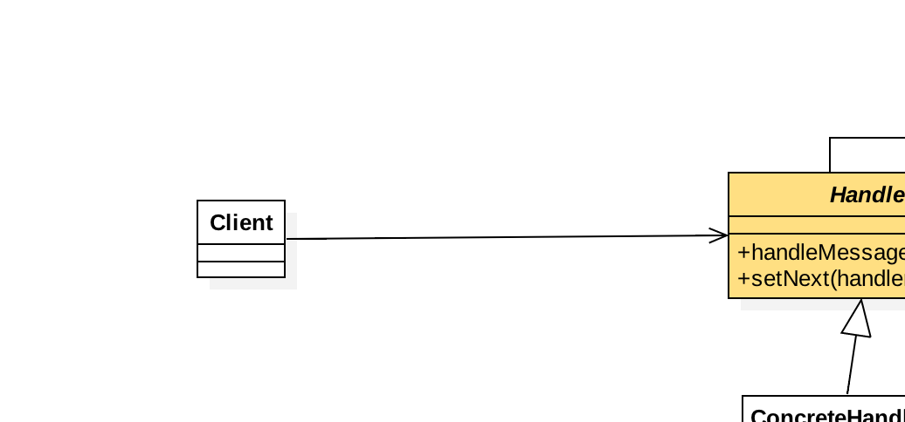

### chain-pattern

##### 定义
>使多个对象都有机会处理请求，从而避免了请求的发送者和接受者之间的耦合。
将这些对象连成一个链条，并沿着链条传递该请求，直到有对象处理它为止。

##### 类图

##### 说明

抽象处理者实现三个职责

1. 定义一个请求的处理方法handleMessage
2. 定义一个链的编排方式 setNext ，设置想一个处理者
3. 定义了具体的请求者必须实现的方法：
    1. 定义能够处理的级别 getHandleLevel
    2. 具体的处理任务 echo
    
##### 利与弊

优点 ： 请求和处理分开，两者进行解耦，提高系统的灵活性。

缺点： 1.性能问题，每个请求都要从头遍历到尾，耗性能  2.调试不方便，由于用到递归了，比较乱。

注意事项 ：避免超长链 ，一定要设置链条的阈值，这样比较方便。
