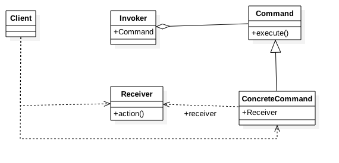

### command pattern

---

##### 定义
> 将一个请求封装成一个对象，从而让你使用不同的请求把客户端参数化。
对请求排队或者记录请求日志，可以提供命令的撤销和恢复功能。

##### 类图

##### 补充说明

1. 希望将行为请求者和行为实现者解耦，不直接打交道。

2. 希望分离掉行为请求者一部分的责任，行为请求者只需要将命令发给调用者，不再主动的去让行为实现者产生行为，符合单一职责原则。

3. 希望可以控制执行的命令列表，方便记录，撤销/重做以及事务等功能。

4. 期待可以将请求排队，有序执行。

5. 希望可以将请求组合使用。

##### Command Pattern的优点

1. 最大的优点，就是将行为请求者和行为实现者解耦。

2. 命令的添加特别方便，并且可以方便的制定各种命令和利用现有命令组合出新的命令。

3. 如果针对每一类具有共同接口的接受者制作一个调用者，可以控制命令的执行情况。

##### PS:
最大的缺点就是会`会增加系统的复杂度`