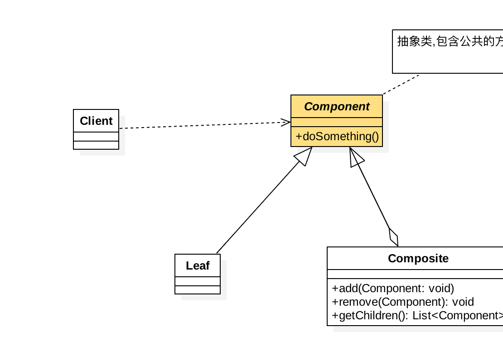

### composite pattern

---

##### 定义
>将对象组合成树形结构以表示 "部分-整体"的层次结构，使得用户对单个对象
和组合对象的使用具有一致性。

##### 类图

##### 优缺点

1. 高层模块调用简单
2. 节点自由增加

缺点就是 和依赖倒置冲突，一般都是直接使用实现类。

##### 使用场景
>树形菜单，省份，文件  这种类似于树形的结构

