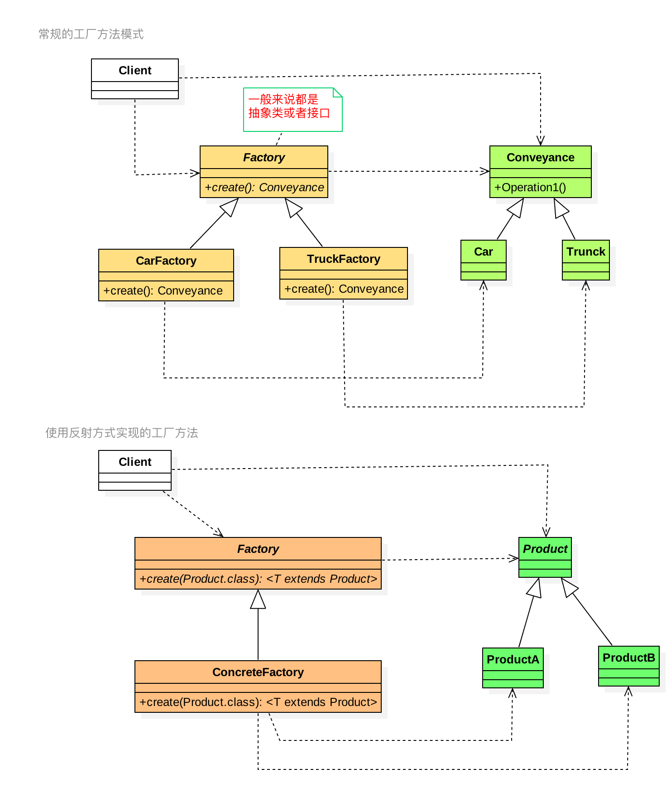

### Factory-Method Pattern
---

#### 定义

```text
工厂方法(Factory Method)模式的意义是定义一个创建产品对象的工厂接口，将实际创建工作推迟到子类当中。
核心工厂类不再负责产品的创建，这样核心类成为一个抽象工厂角色，仅负责具体工厂子类必须实现的接口，这样进一步抽象化的好处是使得工厂方法模式可以使系统在不修改具体工厂角色的情况下引进新的产品。
```

#### 类图
类图如下：<br/>




##### 涉及的角色

* Product 定义工厂方法所创建的对象的接口。
* ProductA / ConcreteProduct 具体的Product接口的实现对象。
* Factory 工厂接口，声明工厂方法。一般来说会返回一个Product类型的实例对象，是抽象方法。
* ConcreteFactory 具体的工厂类，覆盖实现Factory定义的工厂方法，返回具体的Product实例。

