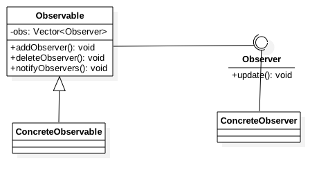

### observer pattern

---

##### 定义
> 观察者模式，又称为发布-订阅模式，在此种模式中，一个目标物件管理所有相依于它的观察者物件，并且在它本身的状态改变时主动发出通知。这通常透过呼叫各观察者所提供的方法来实现。此种模式通常被用来实作事件处理系统。

简单概括为: `就是一个类管理着所有依赖于它的观察者类，并且它状态变化时会主动给这些依赖它的类发出通知`

##### 类图

##### 利与弊

利： 

* 观察者和被观察者之间进行抽象耦合
* 建立一套触发机制
 

弊： 
* 需要考虑开发效率和运行效率，如果一个被观察者，多个观察者，一般需要考虑进行异步通知的方式。

一般需要注意的事项:`广播链的问题`。

