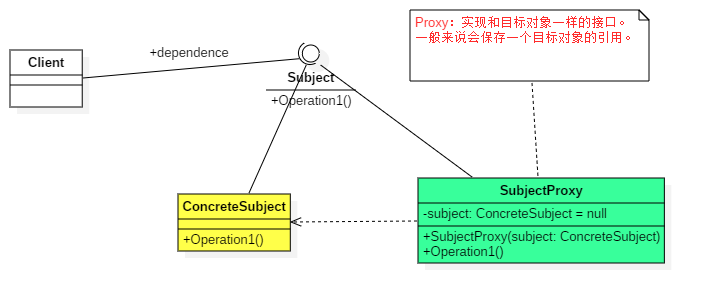
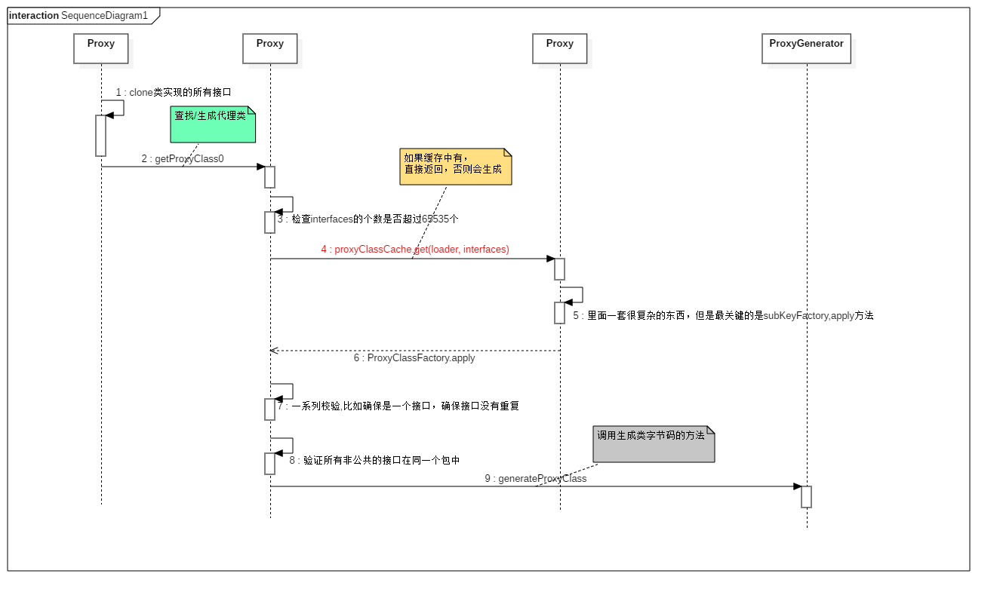

### proxy pattern

---

##### 定义
>所谓代理模式，其实就是一个类别可以作为其它东西的接口

##### 分类

* 静态代理模式
* 动态代理模式

##### 静态代理 类图



##### 静态代理 利与弊

* 利 & 用法

    1. 可以做到在不修改目标对象的功能前提下,对目标功能扩展。
    2. 代理类一般要持有一个被代理的对象的引用。
    3. 对于我们不关心的方法，全部委托给被代理的对象处理。
    4. 自己处理我们关心的方法。
    
* 弊
    1. 代理类和委托类实现相同的接口，同时要实现相同的方法。这样就出现了大量的代码重复。如果接口增加一个方法，除了所有实现类需要实现这个方法外，所有代理类也需要实现此方法。增加了代码维护的复杂度。
  
##### 动态代理
> 动态代理有一个强制性要求，就是被代理的类必须实现某一个接口，或者就是接口本身。

##### 动态代理源码分析-流程图



##### Cglib动态代理

```text
CGLIB是一个强大的高性能的代码生成库。
作为JDK动态代理的互补，它对于那些没有实现接口的类提供了代理方案。
在底层，它使用ASM字节码操纵框架。本质上来说，CGLIB通过产生子类覆盖非final方法来进行代理。
它比使用Java反射的JDK动态代理方法更快。
CGLIB不能代理一个final类或者final方法。
通常来说，你可以使用JDK动态代理方法来创建代理，对于没有接口的情况或者性能因素，CGLIB是一个很好的选择
```

##### 参考资料
* [代理模式详解（包含原理详解）](https://www.cnblogs.com/zuoxiaolong/p/pattern3.html)
* [CGLIB动态代理介绍](http://ifeve.com/cglib-desc/)
* [Java代理模式](https://segmentfault.com/a/1190000011291179)
* [Proxy源码分析](https://www.cnblogs.com/zhangchengzi/p/9713807.html)


  
 
