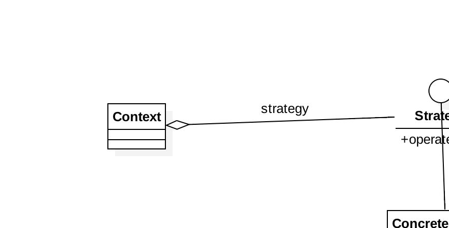

### Strategy Pattern

##### 定义
>定义一组算法，将每个算法都封装起来，并且使他们之间可以互换。

##### 类图

##### 利与弊

1. 算法可以自由切换
2. 避免过多的条件判断
3.扩展性较好

弊：
1. 策略类数量增多
2. 所有的策略类都需要对外暴露

PS: 当一个策略家族具体的策略数量超过4个，就需要考虑混合模式了。

当我们使用策略枚举的时候，需要注意的是这个策略要是比较固定的，不能经常改动。