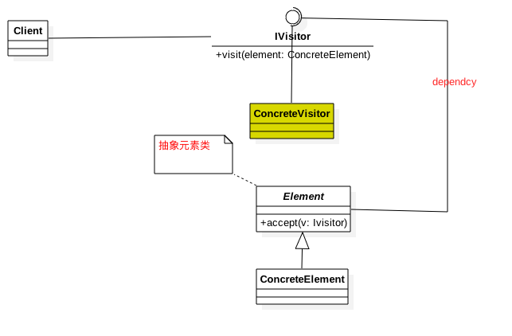

### Visitor Pattern

##### 定义
> 封装一些作用于某种数据结构中的各元素的操作，它可以在不改变数据结构的前提下定义作用于这些元素的新的操作。

##### 类图

##### 角色/职责

1. IVisitor ---访问者接口，声明可以访问哪些元素。
2. ConcreteVisitor ---具体访问者  影响访问者访问到一个类该怎么干，要做啥事
3. Element ---抽象元素类 声明接受哪一类访问者访问，其实就是 `accept`方法
4. ConcreteElement ---具体元素类，实现了`accept`方法，通常是`visitor.visit(this)`，已经形成了一种模式。

